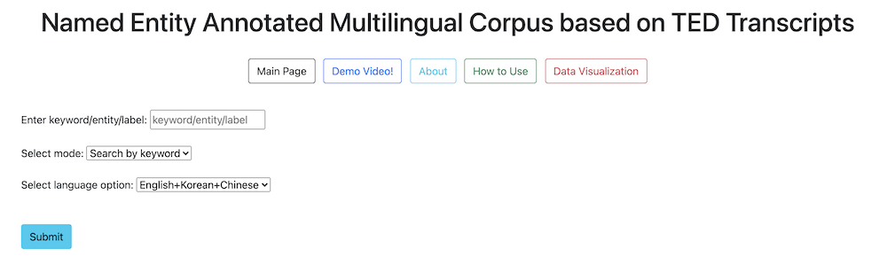
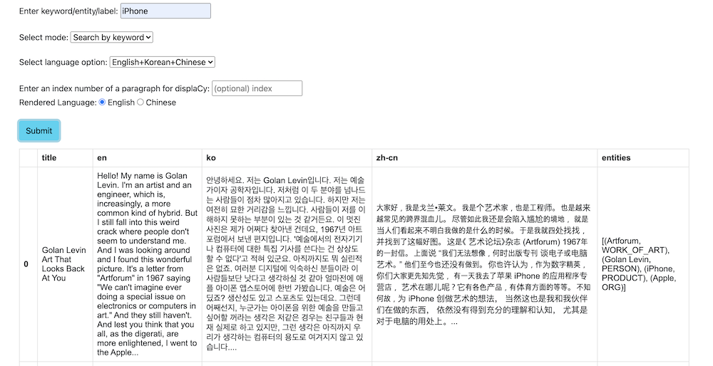
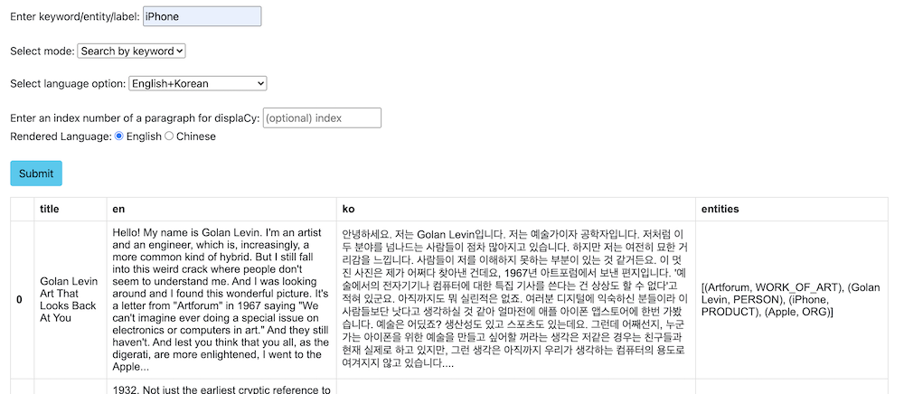
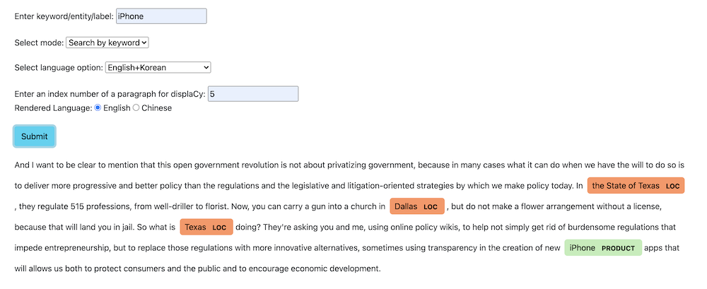
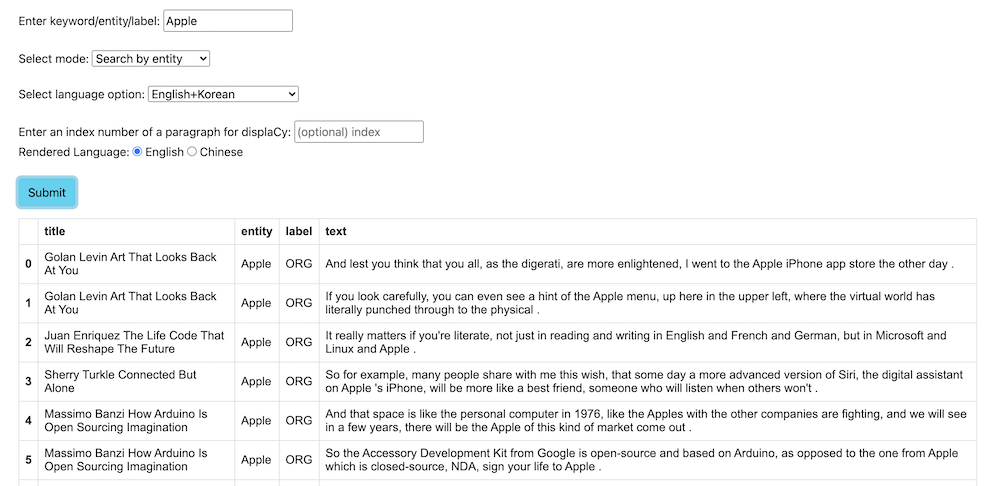
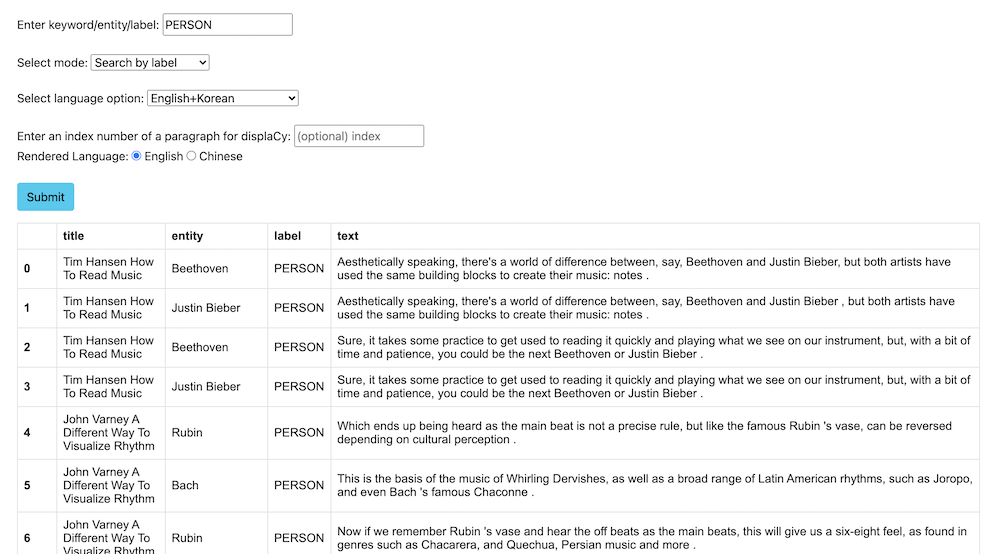
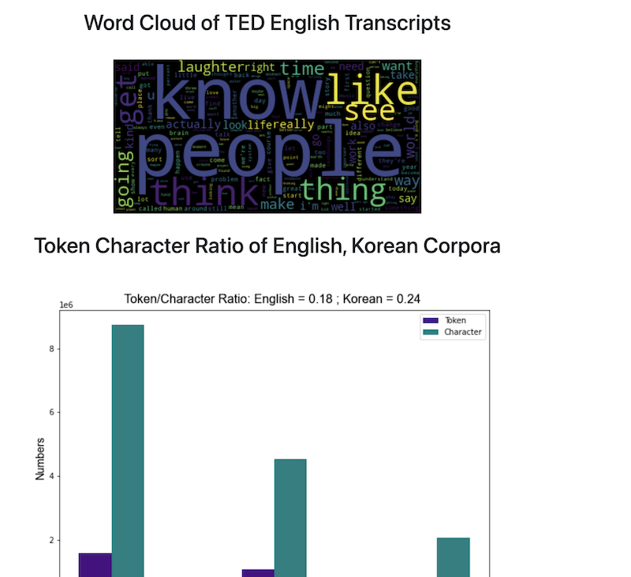

In this project, I and my teammate built a multilingual corpus using TED transcripts with the named entity annotation. 
The duration of the project was only 4 weeks, and we had very limited time to be able to contribute for the project,
so the alignment between languages are not perfect that can be used for other NLP applications such as language projection, MT, etc.
Still, we learned how to build a pipeline for constructing a corpus from scratch, and collecting clearn, high-quality of texts is 
the most important task for all NLP applications.


## 0. Overview of the project

The corpus is a collection of transcripts from TED videos including TEDx talks and TED-Ed across all genres, 
aiming to collect the transcripts in three different languages (English, Korean, and Chinese (simplified)). 
For automatic named entity extraction, we applied an English and Chinese model from spaCy, 
then we published our annotations to Amazon Mechanical Turk in order to improve the quality of the annotations (Krippendorf's alpha score of 0.7348).


## 1. Data Scource

We chose TED as the source of the corpus for three reasons.

- TED is a diverse global community that spreads world-changing ideas in concise but powerful talks. There are a wide variety of such videos across all genres by world-renowned speakers. Transcripts Vocabulary would be highly diverse, and this characteristic of the corpus will be well suitable for our annotation work (i.e., Named Entity annotation), because correctly recognizing those entities plays an important role in many different natural language processing tasks such as machine translation.

- TED offers 100,000+ videos, each with a duration of approximately 15 minutes. The transcripts of each video have around 1,000+ tokens. Generally speaking, on TED, videos often have 15+ translations, with a total mixture of 100+ languages (Salesky et al., 2021). This means that there are enough resources to construct a corpus with around 1M tokens, as well as a multilingual corpus.

- The transcripts of different languages are often aligned in paragraphs along with timestamps. It is not perfect as they are not parallelly aligned (sentence by sentence), however, with the extra effort of multilingual projection, this is good enough to easily build a multi-parallel corpus.


## 2. Corpus Specifications

|  Feature              |            Value                            |
| :---        |    :----   |   
| **Data Source**       | Transcripts from TEDx talks and TED-Ed      |
| **Data Source URL**   | [https://www.ted.com/talks?sort=newest](https://www.ted.com/talks?sort=newest)     |
| **Text Type**         | Public speech transcripts across all genres by world-renowned speakers (TEDx Talks)|
|                       | Short video lessons by experts across all genres (TED-Ed)  |
| **Document Length**   | Roughly 1,000+ tokens per document          |
| **Target**            | Speech text and translations across all genres    |
| **Languages**         | -   English, Korean, and Chinese (simplified)<br>-   Potentially extend to French and Spanish           
| **Data availability** | There is enough data to construct a "brown-size" corpus. (over 150,000 videos with English transcripts | |                       |   and translations in 100+ languages)       |
| **Structure**         | Final Data would be stored in a (.csv/.txt) file  |
| **Metadata**          | It would include:<br> -   `Video URL`<br> -   `Speaker name`<br> -   `Language`<br> -   `Topic`<br> -   `Title`<br> -   `Date (Month & Year)`<br> -   `Related tags`<br> -   `Views`<br> -   `Length of tokens in each transcript`<br>
| **Pre-processing**    | Pre-processing techniques might include:<br> -   `Removing punctuations`<br> -   `Removing stop words`<br> -   `Tokenization`<br> -   `Lemmatization`<br> -   `Sentence segmentation`<br> -   `Morphological analysis`<br> -   `Automated named entity recognition`      |
| **Annotation**        | Named entity annotation                     |
| **Other**             | Translations of each transcript are aligned in paragraph-wise |


## 3. Scraping Method

We scraped data using `urlopen` from `urllib.request` and `BeautifulSoup` from `bs4`. 

### 3.1 Main algorithm

- 1. Check existing output files of English, and update the done_list
- 2. Get todo_talks from todo_list_files
- 3. while there are entries in todo_talks and n < NUM_DOCUMENTS:
	- 3.1. Pull out current talk from todo_talks
	- 3.2. Check if the current talk have the transcripts of all desired languages (default: ko, en, zh-cn)
	- 3.3. while scraping does not succeed and until we try at least 10 times:
		- 3.3.1. Try to scrape TED transcripts for each language. If this succeeds, change success = True. Also, get a list of related talks with respect to the current talk.
		- 3.3.2. If there is an error, then try to sleep for one second and try again.
	- 3.4. For talk in talks, if talk is not in the done_list, then add the talk in todo_talks.


## 4. Preliminary Corpus Format and Details

### 4.1 Corpus Format

The format of the data we have collected is in Json files, which is a list of dictionaries; each dictionary contains one example of the data collected for one talk. You may find one example of a transcript as follow:

```
[
    {
        "title":"anita_collins_how_playing_an_instrument_benefits_your_brain",
        "talker":"Anita Collins",
        "text_length":4515,
        "views":"10,175,572",
        "language":"en",
        "text":" text
        "url":"https://www.ted.com/talks/anita_collins_how_playing_an_instrument_benefits_your_brain/transcript?language=en"
    },
    { ...
```
The data collected for each transcript is a dictionary consisting of the keys and explanations as follows:

- title: The title of the talk in words separated with under scores.
- talker: The name of the presenter; first name and last name capitalized and space separated. It helps to find information about the presenters.
- text_length: The number of the words in the talk. It shows how elaborate the talk is on the specific topic.
- views: The number of views the talk receives across its online present. It shows the popularity of the talk among viewers.
- language: The language of the talk. It will help to separate talks from different languages.
- text: The specific talk transcript.
- url: The link to the talk. It will help to find the talk online.

### 4.2 Corpus Details

#### 4.2.1 Total number of documents, tokens, characters
	
| Language    | No. of Documents | No. of tokens | No. of Character | No. of Paragraphs |
|-------------|-------------------|---------------|------------------|-------------------|
| **English** | 780               | 1,581,957     | 8,747,004        | 21,927            |
| **Korean**  | 771               | 1,076,770     | 4,542,943        | 19,637            |
| **Chinese** | 524               | -             | 2,084,021        | 12,760            |


#### 4.2.2 A summarized analysis on the English transcripts
- Analysis on the TED Talk corpus showed that:
	- Average number of words per talk is: 2027.29
	- Average number of words per paragraph is: 72.12
	- Average number of paragraphs per talks is: 28.11


## 5. Annotation process

The annotation process includes three major steps.

### 5.1 Extract Named Entities Using spaCy and Store the Result in a Json File

First, we are going to extract named entities in the corpus using spaCy. More specifically, we will create json-structured dictionaries for each paragraph in the corpus. Each dictionary contains:
- text: A text of each paragraph
- ents: A list of entities in each paragraph. Each entity contains the start index, the end index, and the label.
- title: The title of each paragraph. By default, it is None for all paragraphs.

The example code for constructing the dictionary is as below:

```python
nlp = en_core_web_sm.load()
def extract_ne(paragraph):
    doc = nlp(paragraph)
    ne_dict = {}
    ne_dict["text"] = paragraph
    ents = []
    for ent in doc.ents:
        ent_dict = {}
        ent_dict["start"] = ent.start_char
        ent_dict["end"] = ent.end_char
        ent_dict["label"] = ent.label_
        ents.append(ent_dict)
    ne_dict["ents"] = ents
    ne_dict["title"] = None
    return ne_dict
```
Also, the output of the paragraph after applying the function will be as below:

```python
{'text': 'How do we know this? Well, in the last few decades, neuroscientists have made enormous breakthroughs in understanding how our brains work by monitoring them in real time with instruments like fMRI and PET scanners. When people are hooked up to these machines, tasks, such as reading or doing math problems, each have corresponding areas of the brain where activity can be observed. But when researchers got the participants to listen to music, they saw fireworks. Multiple areas of their brains were lighting up at once, as they processed the sound, took it apart to understand elements like melody and rhythm, and then put it all back together into unified musical experience. And our brains do all this work in the split second between when we first hear the music and when our foot starts to tap along.',
  'ents': [{'start': 30, 'end': 50, 'label': 'DATE'},
   {'start': 52, 'end': 67, 'label': 'NORP'},
   {'start': 201, 'end': 204, 'label': 'ORG'},
   {'start': 723, 'end': 729, 'label': 'CARDINAL'},
   {'start': 746, 'end': 751, 'label': 'ORDINAL'}],
  'title': None},
```

This json structure can be used for visualizing named entity annotations.

****

### 5.2 Preparing a CSV file for AMT

The second step is preparing a CSV file in order to fix the errors of automatically-generated labels from spaCy. Specifically, we will use Mechanical Turk for correcting annotations.

In order to enhance the quality of the annotations, we will provide context around each entity.

For example, in this paragraph:

```
How do we know this? Well, in the last few decades, neuroscientists have made enormous breakthroughs in understanding how our brains work by monitoring them in real time with instruments like fMRI and PET scanners. When people are hooked up to these machines,
```
if we assign a task to confirm (or correct) the label of “**neuroscientists**”, the contexts around “**neuroscientists**”” will be offered as well as the current label.

| text_id | para_id | ent_id | before                          | entity          | after                                              | label |
|---------|---------|--------|---------------------------------|-----------------|----------------------------------------------------|-------|
| 0       | 1       | 3      | Well, in the last few decades,  | neuroscientists | have made enormous breakthroughs in understanding  | NORP  |

-   text_id: the index of the text where the entity is.
-   para_id: the index of the paragraph where the entity is.
-   ent_id: the index of the entity.
-   before: the context before the entity.
-   entity: the entity.
-   after: the context after the entity.
-   label: the current label of the entity generated by spaCy.

So, each annotator will decide whether the current label is correct for the entity. If it is correct, they will choose “yes”, and if it is incorrect, they will choose “no” along with the most appropriate label.

 The list of labels of named entity is as follows.
 
| Type        | Description                                          |
|-------------|------------------------------------------------------|
| PERSON      | People, including fictional.                         |
| NORP        | Nationalities or religious or political groups.      |
| FAC         | Buildings, airports, highways, bridges, etc.         |
| ORG         | Companies, agencies, institutions, etc.              |
| GPE         | Countries, cities, states.                           |
| LOC         | Non-GRE locations, mountain ranges, bodies of water. |
| PRODUCT     | Objects, vehicles, foods, etc (Not services.)        |
| EVENT       | Named hurricanes, battles, wars, sports events, etc. |
| WORK_OF_ART | Title of books, songs, etc.                          |
| LAW         | Named documents made into laws.                      |
| LANGUAGE    | Any named language.                                  |
| DATE        | Absolute or relative dates or periods.               |
| TIME        | Times smaller than a day.                            |
| PERCENT     | Percentage, including “%”.                           |
| MONEY       | Monetary values, including unit.                     |
| QUANTITY    | Measurements, as of weight or distance.              |
| ORDINAL     | “first”, “second”, etc.                              |
| CARDINAL    | Numerals that do not fall under another type.        |
| N/A         | If any of the above is applied.                      |
source: [spaCy](https://spacy.io/usage/linguistic-features#named-entities) 

### 5.3 Update labels with the human-fixed labels

The last step of the annotation is to update automatically-generated labels with the human-fixed ones.  

After the annotation is completed by workers from AMS, we expect the structure of the annotated CSV file would be as below:

| text_id | para_id | ent_id | before                          | entity          | after                                              | label | annotation  |
|---------|---------|--------|---------------------------------|-----------------|----------------------------------------------------|-------|-------------|
| 0       | 1       | 3      | Well, in the last few decades,  | neuroscientists | have made enormous breakthroughs in understanding  | NORP  | NO: PERSON |

(**note**: “PERSON” might not be the correct annotation, but we will accept all the manual annotations by workers.)

Using text_id, para_id, and the ent_id, we will replace the annotation by spaCy with the annotation by human workers. For example,
```python
# corpus[text_id][para_id]["ents"][ent_id]["label"] = "new_label"
corpus[0][1]["ents"][3]["label"] = "PERSON"
```


### 5.4 Final Structure of the Corpus after Applying Automatic Named Entity Extraction

```python
[
    {'title': 'TEXT1',
     'paragraphs': [
                {'text': "It gets worse. The New York Post filed a Freedom of Information Act request, got all the teachers' names and all their scores and they published them as an act of teacher-shaming. When I tried to get the formulas, the source code, through the same means, I was told I couldn't. I was denied. I later found out that nobody in New York City had access to that formula. No one understood it. Then someone really smart got involved, Gary Rubinstein. He found 665 teachers from that New York Post data that actually had two scores. That could happen if they were teaching seventh grade math and eighth grade math. He decided to plot them. Each dot represents a teacher.",
                 'ents': [{'start': 15, 'end': 32, 'label': 'ORG'},
                  {'start': 39, 'end': 67, 'label': 'LAW'},
                  {'start': 325, 'end': 338, 'label': 'GPE'},
                  {'start': 429, 'end': 444, 'label': 'PERSON'},
                  {'start': 455, 'end': 458, 'label': 'CARDINAL'},
                  {'start': 478, 'end': 491, 'label': 'ORG'},
                  {'start': 515, 'end': 518, 'label': 'CARDINAL'},
                  {'start': 567, 'end': 574, 'label': 'ORDINAL'},
                  {'start': 590, 'end': 596, 'label': 'ORDINAL'}],
                 'title': None},
                 {'text': 'But it was. This is Sarah Wysocki. She got fired, along with 205 other teachers, from the Washington, DC school district, even though she had great recommendations from her principal and the parents of her kids.',
			     'ents': [{'start': 20, 'end': 33, 'label': 'PERSON'},
					      {'start': 61, 'end': 64, 'label': 'CARDINAL'},
					      {'start': 90, 'end': 100, 'label': 'GPE'}],
			     'title': None},
                   ...
                   ],
    },
    {'title': 'TITLE2',
     'paragraphs': [{'para1'},
				     {'para2'}, .
				     ..]
    },
    ...
]
```

### 5.5 Amazon Mechanical Turk annotation

For correcting errors of spaCy annotation, we created a CSV file containing entities, labels, and the contexts associated with each entity as well as the indices of documents, paragraphs, and entities. 
Furthermore, we reduced the number of labels to 6, which include PERSON, ORG, LOC, PRODUCT, EVENT, and WORK_OF_ART. The label FAC was combined with ORG, and the label GPE was combined with LOC to avoid confusion due to their similarities. 

We originally extracted around 1,500 unique entity-label pairs, but because of the financial limitation of our project, we had to truncate some labels from the original CSV file. As a result, we were able to publish 790 unique entity-label pairs. 

We published our assignments to AMT. The error corrections were done in an hour. Unlike the pilot study, we changed our layout to display the label descriptions on the main page, and we added an additional qualification for workers: HIT approval rate % for all requesters’ HITs greater than 85. 

However, even with the modified settings above, we faced some issues during the annotation process. First, sometimes workers did not click “YES”, instead they clicked “NO” with the correct label (which was already given to workers) for that entity. Second, we had to pay the extra 0.01 dollar to Amazon (not for workers), so the final cost was doubled. Therefore, we had to truncate our assignments as we discussed above. Lastly, there were some workers who had 0% of HIT approval rate even though we set the additional qualification. To avoid this situation, we should have added another criterion for the number of HITs approved. 

In the end, we obtained 2,370 annotations from three workers, with the 790 unique entity-label combinations. 

### 5.6 Selecting the best labels and update new labels to the corpus

The last step for creating our annotated corpus was to select the “best” labels from AMT workers and update those in the original corpus. 

The best labels were selected by the principle of majority vote from the three workers. In case of a tie (i.e. all three labels are different), we used the system label from spaCy. Also, when updating the labels, we updated new labels to all instances of entities in the corpus, not just the unique entities that we used for AMT annotations. If there were more than two annotations for one entity, we applied the corrected labels only if we had talk_id, para_id, ent_id. Other than that, we skipped correcting those cases. 

## 6. Building and Deploying an Interface



To respect the policy of TED, we cannot distirubte the corpus that we built. 
Therefore, I will just introduce the functions of the interface with the screen captures below.

### 6.1 Main Functions

#### 6.1.1 Search for paragraphs using a keyword

##### Image1. Search keyword with the default setting


##### Image2. search keyword in English, Korean paragraphs


##### Image3. rendering paragraphs and named entity annotations with displaCy


#### 6.1.2 Search for the contexts surrounding a named entity



#### 6.1.3 Search for the contexts surrounding a named entity label



#### 6.2 Other available functions



	a. Main Page: Move to the main page.
	b. Demo Video!: Open our demo video.
	c. About: Short introduction of our project and the names of contributors
	d. How to Use: Explanation on how to use the interface.
	e. Data Visualization: Data Visualizations of the corpus.


#### 6.3 Deployment

We used Docker to deploy our corpus. However, as I stated above, we did not actually deploy the program to the Docker server, we made docker image files and internally shared to try out each other's corpus.

##### Dockerfile

```docker
FROM python:3.8-slim-buster
COPY . .
RUN pip install -r requirements.txt
RUN python -m spacy download zh_core_web_sm
WORKDIR "/interface"
CMD ["python", "backend.py"]
```

##### Running docker image file

1. Download `group_2_img.tar` . (not available publicly)
2. Load the docker image using this command: `docker load < group_2_img.tar`
3. Run command `docker run -p 9999:9999 group_2_img`
4. Go to `localhost:9999` using your browser (Chrome recommended).
